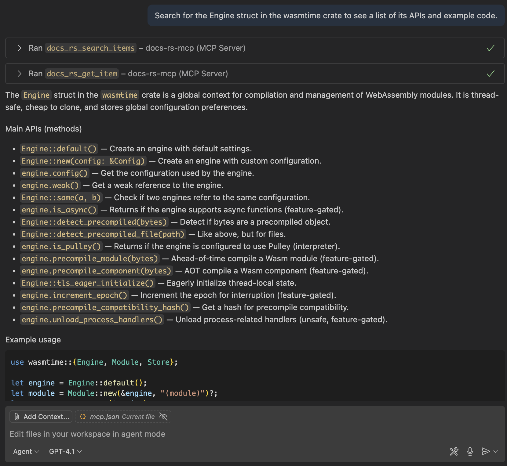

# docs.rs MCP
An MCP server that enables searching for Rust crates and their documentation from docs.rs.

English | [日本語](./README_JA.md)

## 概要

docs.rs MCPはRustクレートのドキュメントサイト[docs.rs](https://docs.rs)の検索を行うMCPサーバーです。これを利用することにより、AI Agentが必要なクレートを検索したり、最新のドキュメントを取得することが可能になります。



## 特徴

* docs.rsの検索に特化したTool
* クレート自体の検索から特定のAPIの検索まで、複数のユースケースに対応
* LLMフレンドリーなMarkdown形式の出力

## 要件

* Node.js 18以上
* VS Code、Cursor、Claude DesktopなどのMCPクライアント

## セットアップ

### Visual Studio Code (VSCode)

`.vscode/mcp.json`に以下を追加します。

```json
{
    "servers": {
        "docs-rs": {
            "command": "npx",
            "args": [
                "@nuskey8/docs-rs-mcp@latest",
                "-y"
            ]
        }
    }
}
```

### Claude Code

以下のコマンドを実行します。

```text
claude mcp add docs-rs -s project -- npx -y @nuskey8/docs-rs-mcp@latest
```

### Cursor

以下のボタンを押してインストールできます。

[](https://cursor.com/install-mcp?name=docs-rs&config=JTdCJTIyY29tbWFuZCUyMiUzQSUyMm5weCUyMCU0MG51c2tleTglMkZkb2NzLXJzLW1jcCU0MGxhdGVzdCUyMiU3RA%3D%3D)

または、`Cursor Settings > MCP > Add new MCP Server`から`npx @nuskey8/docs-rs-mcp`コマンドを実行するMCPサーバーを追加してください。

### その他

その他のツールについては、適宜ドキュメント等を参考に`npx @nuskey8/docs-rs-mcp`コマンドを実行するMCPサーバーを追加してください。

## ツール

| ツール                    | 説明                                                                                                     |
| ------------------------- | -------------------------------------------------------------------------------------------------------- |
| `docs_rs_search_crates`   | キーワードからクレートの検索を行います。                                                                 |
| `docs_rs_readme`          | 指定されたクレートの内容のREADME/概要を取得します.                                                       |
| `docs_rs_get_item`        | クレート内の特定のアイテム（モジュール、構造体、トレイト、列挙型、関数など）のドキュメントを取得します。 |
| `docs_rs_search_in_crate` | クレート内のall.htmlページから、トレイト、構造体、メソッドなどを検索します。                             |

## ライセンス

このライブラリは[MITライセンス](./LICENSE)の下で提供されています。